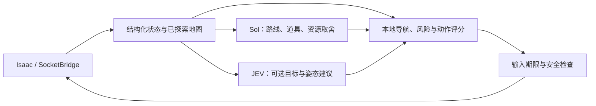

# Isaac Sol + JEV Agent

[](https://github.com/zzx060828/isaac-sol-jev-agent/actions/workflows/tests.yml)

**v0.1.0-alpha · 实验性原型**

通过 SocketBridge 读取《以撒的结合》的结构化状态，使用 Sol 异步规划、本地控制器连续执行，并提供可关闭的 JEV 战术建议。项目包含源码、离线测试、游戏模组构建脚本和评估摘要。公开整理版已通过468项离线/本地Socket回归测试。

> 尚未达到稳定自主通关或高手水平；可能在障碍物、地刺或规划失败时停滞，需要人工接管。已实测 Windows Repentance；Repentance+ 的接口兼容不等于完整实测支持。

## 架构与真实分工



- **Sol**：处理道具选择、路线和资源抉择；可以提前生成需要再次验证的条件预案。
- **JEV**：混合战斗中选择候选敌人及短期姿态。实际移动、瞄准和即时避险主要由本地控制完成。
- **本地执行器**：9种移动 × 5种射击、免费资源拾取、部分消耗品和受限的炸墙/交易合同。
- **日志**：记录请求、采用或丢弃原因、动作与游戏回执；离线回放不等于反事实游戏模拟。

配置字段`[astra]`是兼容保留名称；本轮高层模型实际为`gpt-5.6-sol`。没有新训练的模型或在线强化学习。

## 快速开始：不需要游戏或密钥

Python 3.11+，核心运行时只使用标准库。

```bash
git clone https://github.com/zzx060828/isaac-sol-jev-agent.git
cd isaac-sol-jev-agent
python -m isaac_agent demo --frames 30
python -m unittest discover -s tests -v
python scripts/build_mod.py
```

Linux/WSL可将`python`换为`python3`。也可`python -m pip install .`，随后运行`isaac-agent --help`。游戏模组、配置助手及录像脚本以源码检出目录运行。

## 连接游戏

1. 构建后，将`build/SocketBridge_AstraJev/`复制到实际游戏的mods目录，保留其中许可证。不要同时启用上游原版桥接。
2. Steam游戏启动选项追加`--luadebug`，在Mods菜单启用该模组。
3. 先运行观察模式，再进入游戏，确认状态和握手：

```bash
python -m isaac_agent live --observe-only --seconds 60
python -m isaac_agent live --mode local --seconds 60
```

F3可恢复人工控制。默认TCP地址`127.0.0.1:9527`；Windows与WSL网络需自行确认连通。详见[安装指南](docs/SETUP.md)。

## 配置模型

复制`config.example.toml`为`config.local.toml`，填写实际可用的完整endpoint、模型及密钥环境变量名。示例Sol地址是本地兼容网关，需要自行运行；项目不会提供或启动网关。所填模型必须由你的服务商支持。

密钥通过环境变量`OPENAI_API_KEY`、`OPENROUTER_API_KEY`提供，或在Windows检出目录运行`python scripts/configure_keys_windows.py`使用遮蔽输入框。不要把密钥放进命令截图、提交或公开Issue。

```bash
# Sol + 本地控制基线：不需要 JEV 密钥
python -m isaac_agent live --mode hybrid --jev-scope off --config config.local.toml --seconds 120
# 加入 JEV 战斗建议
python -m isaac_agent live --mode hybrid --jev-scope tactics --config config.local.toml --seconds 120
```

`local`不调用Sol，不能用它代替Sol＋本地控制的消融基线。`--jev-scope all`还启用实验目标/记忆分支；本轮对照未测量这些分支的收益。模型调用可能产生费用，按自己的服务商账单核算。

## 评估结果与限制

冻结原型登记6组、12个案例，10个实际进入玩法；4组有匹配开局的完整玩法日志，3组录像检查完整。JEV改变过部分动作，但尚未证明稳定推进或战斗收益。详见[评估摘要](docs/EVALUATION.md)，不以演示片段代替对照。

已知问题包括障碍后敌人的射击位置搜索、地刺旁绕行停滞、机制知识与风险模型不一致，以及无效规划/接口错误导致等待。未覆盖全部角色、特殊武器、冠军变体和模组内容。

公开版移除了个人路径和实验产物，增加安装说明与回归检查；没有声称这些发布整理已经改善实机胜率。

## 项目导航

| 目录 | 内容 |
|---|---|
| `isaac_agent/` | 状态、规划、战术、控制与资源执行 |
| `scripts/` | 模组构建、安装、日志及可选Windows录像 |
| `tests/` | 离线回归与本地Socket测试、精选状态fixture |
| `vendor/socketbridge/` | 上游源码、许可证与哈希 |
| `docs/` | 安装、架构、评估、录像及Git实验 |

[架构](docs/ARCHITECTURE.md) · [录像](docs/RECORDING.md) · [贡献](CONTRIBUTING.md) · [第三方来源](THIRD_PARTY_NOTICES.md)

## 许可证与来源

项目原创代码采用[MIT](LICENSE)。SocketBridge保留其MIT许可证与上游署名；游戏资源和第三方内容不因此重新授权。知识条目保留来源链接，EID描述从用户本机安装读取，不打包EID完整描述或游戏资源。

参考：[SocketBridge](https://github.com/EmptyEmeraldTablet/SocketBridge)、[The-RL-of-Isaac](https://github.com/Seladus/The-RL-of-Isaac)、[Minecraft Agent](https://github.com/rmalde/minecraft-agent)。项目不是上述作者或游戏官方产品。
